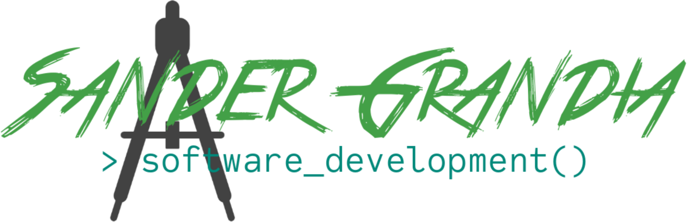

# sandergrandia.nl

> Website for Sander Grandia Software Development.

## [Terminal](https://sandergrandia.nl/terminal/)

Virtual terminal session with virtual file system.

Ooh and ASCII art. Of course...

## Build with

▐█▀▀▀▀█ 
&nbsp;█▌&nbsp;&nbsp;&nbsp;&nbsp;█▄ 
&nbsp;▀█&nbsp;&nbsp;&nbsp;&nbsp;▀█&nbsp;&nbsp;&nbsp;&nbsp;&nbsp;&nbsp;&nbsp;&nbsp;█▀▀▀▀▄ 
&nbsp;&nbsp;▀█&nbsp;&nbsp;&nbsp;&nbsp;▐█&nbsp;&nbsp;&nbsp;&nbsp;&nbsp;&nbsp;&nbsp;&nbsp;▀▄&nbsp;&nbsp;▐█ 
&nbsp;&nbsp;&nbsp;▀█&nbsp;&nbsp;&nbsp;&nbsp;&nbsp;█▄&nbsp;&nbsp;▄▄▄▄▀▀█▀▀ 
&nbsp;&nbsp;&nbsp;&nbsp;▀█▄▄██▀██▀&nbsp;&nbsp;&nbsp;&nbsp;&nbsp;&nbsp;&nbsp;▀▄ 
&nbsp;&nbsp;&nbsp;&nbsp;&nbsp;&nbsp;&nbsp;&nbsp;&nbsp;&nbsp;&nbsp;&nbsp;▀█&nbsp;&nbsp;&nbsp;&nbsp;&nbsp;▄▄▄█▀ 
&nbsp;&nbsp;&nbsp;&nbsp;&nbsp;&nbsp;&nbsp;&nbsp;&nbsp;&nbsp;&nbsp;&nbsp;&nbsp;▐███▀▀▀ 

&nbsp;&nbsp;&nbsp;&nbsp;&nbsp;&nbsp;&nbsp;&nbsp;&nbsp;Laravel 7
